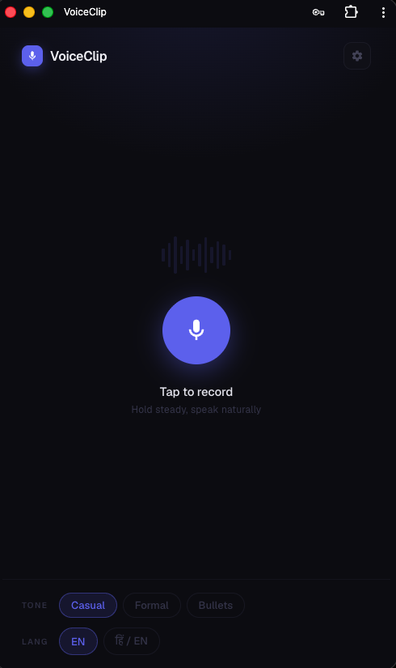
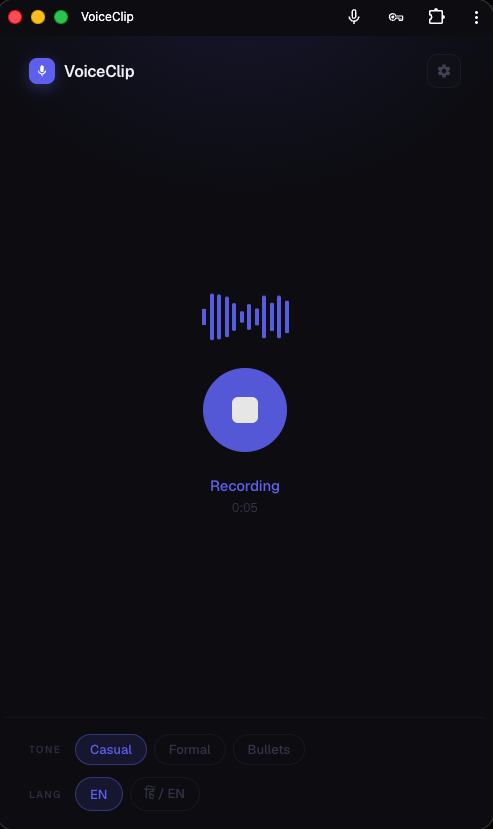
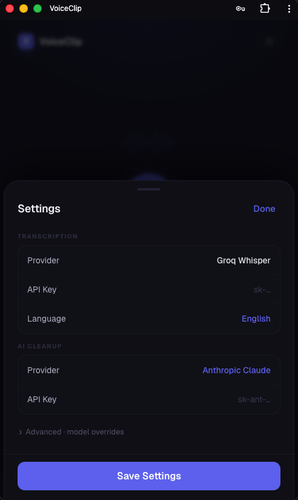

# VoiceClip

A zero-dependency PWA that records your voice, transcribes it, and cleans up the text with AI — in one tap. No build step, no framework, no npm.

[](./LICENSE)

---

## Screenshots

| Idle | Recording | Settings |
|------|-----------|----------|
|  |  |  |

---

## What it does

1. **Record** — tap the mic button, speak naturally
2. **Transcribe** — via browser Web Speech API or your choice of API provider
3. **Clean up** — AI removes filler words, fixes punctuation, applies your tone preference
4. **Copy** — one tap to clipboard

Works offline after first load. Installable as a PWA on iOS and Android.

## Demo

🔗 **[your-app.vercel.app](https://your-app.vercel.app)** ← update after deploying

## Features

- 🎙 One-tap recording with live waveform visualizer
- 🤖 Multiple transcription providers — browser (free), OpenAI Whisper, Groq, GPT-4o Mini
- ✨ AI cleanup with tone control — Casual, Formal, or Bullet points
- 🌐 Hindi/English (Hinglish) support
- 📋 Copy to clipboard with green confirmation
- 💾 Installable PWA, works offline
- 🔒 API keys stored locally — nothing sent to any backend except your chosen provider

## Quick start

```bash
cd voiceclip
npx serve .
# Open http://localhost:3000
```

## Getting API keys

VoiceClip works out of the box using the free browser speech engine — no key needed. To upgrade to a better provider, grab a key from one of these:

### Transcription

| Provider | Where to get a key | Free tier |
|----------|--------------------|-----------|
| **OpenAI Whisper** | [platform.openai.com/api-keys](https://platform.openai.com/api-keys) | No — pay per use ($0.006/min) |
| **Groq Whisper** | [console.groq.com/keys](https://console.groq.com/keys) | Yes — generous free tier |
| **OpenAI GPT-4o Mini** | [platform.openai.com/api-keys](https://platform.openai.com/api-keys) | No — pay per use ($0.003/min) |

### AI Cleanup

| Provider | Where to get a key | Free tier |
|----------|--------------------|-----------|
| **Anthropic Claude** | [console.anthropic.com/settings/keys](https://console.anthropic.com/settings/keys) | No — pay per use (very cheap with Haiku) |
| **OpenAI GPT-4o Mini** | [platform.openai.com/api-keys](https://platform.openai.com/api-keys) | No — pay per use |
| **Groq Llama** | [console.groq.com/keys](https://console.groq.com/keys) | Yes — generous free tier |

Once you have a key, open the app → tap the gear icon → paste it in. Keys are saved to your browser's `localStorage` and never leave your device.

## Project structure

```
voiceclip/          ← the app (deploy this folder)
  index.html        ← shell markup
  app.js            ← all JavaScript
  style.css         ← all CSS
  service-worker.js ← PWA offline cache
  manifest.json     ← PWA metadata
  icon-*.svg        ← app icons
resources/          ← screenshots and assets for this README
AGENTS.md           ← architecture guide for AI assistants
CONTRIBUTING.md     ← how to contribute
LICENSE             ← MIT
```

## Deploying

```bash
npm install -g vercel
cd voiceclip && vercel --prod
```

## How this was built

VoiceClip was generated from a single prompt. If you want to fork it, extend it, or rebuild it from scratch with different requirements, the original spec is at [`.github/prompts/app_initialize.prompt.md`](./.github/prompts/app_initialize.prompt.md). Paste it into any AI coding assistant and it'll produce all seven files in one shot.

## Contributing

See [CONTRIBUTING.md](./CONTRIBUTING.md).

## License

MIT © 2026 Vijay Yadav
